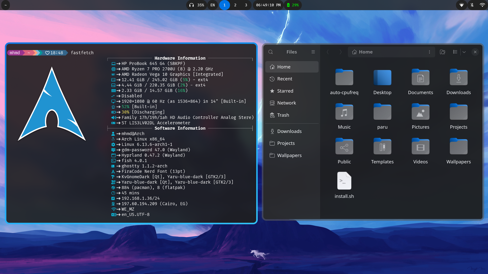
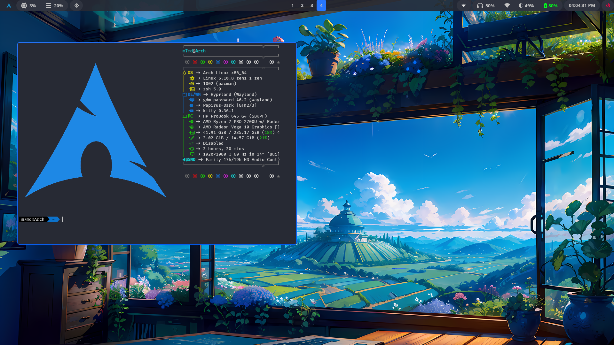
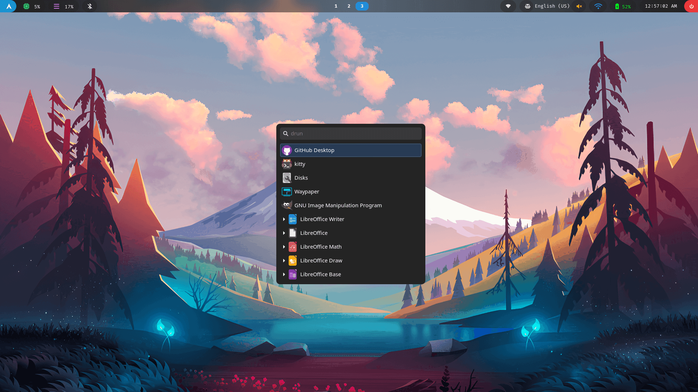
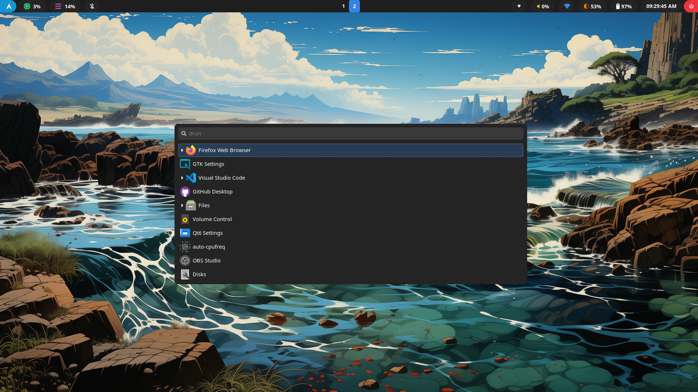
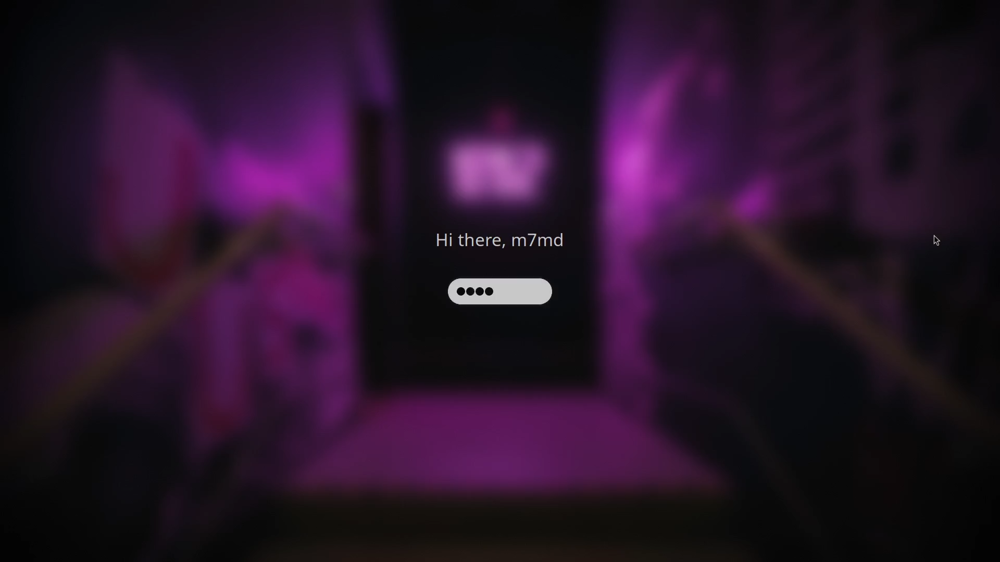

# myHyprland Dotfiles

This is my arch linux + hyprland setup

## Screenshots







## Details

- **OS**: Arch Linux
- **WM**: Hyprland
- **Terminal**: Kitty
- **System font**: Noto Sans Regular
- **Terminal Font**: FiraCode Nerd Font
- **Theme**: adw-gtk-theme
- **Icons**: [Papirus icons](https://github.com/PapirusDevelopmentTeam/papirus-icon-theme)
- **Status bar**: Waybar
- **Launcher**: wofi
- **Shell**: zsh
- **Prompt**: oh-my-zsh
- **File manager**: Thunar
- **Editor**: leafpad/nano/vscode
- **Wallpaper**: swww
- **Color picker**: hyprpicker
- **Lock**: hyprlock
- **Clipboard**: cliphist -> nwg-clipman
- **Wallpapers**: [Wallpaper-bank](https://github.com/JaKooLit/Wallpaper-Bank)
- **Logout**: wlogout
- **Bluetooth**: blueberry

## How I installed this

1. Download archlinux iso
2. Configure my hard with fdisk
3. launch archinstall script

- in profile i choose xorg and amd/ati (based on your gpu and cpu)
- in additional packages install: git networkmanager

4. after arch installed i clone this repo and run sh files to install all the packages

```
git clone https://github.com/mhmd1619/myHyprland.git
cd myHyprland
chmod +x *
./packages.sh
./aur.sh
./yay.sh
cp -r ./.config/* $HOME/.config/
```

5. install oh-my-zsh

```
sh -c "$(curl -fsSL https://raw.githubusercontent.com/ohmyzsh/ohmyzsh/master/tools/install.sh)"
git clone https://github.com/zsh-users/zsh-syntax-highlighting.git ${ZSH_CUSTOM:-~/.oh-my-zsh/custom}/plugins/zsh-syntax-highlighting
git clone https://github.com/zsh-users/zsh-autosuggestions ${ZSH_CUSTOM:-~/.oh-my-zsh/custom}/plugins/zsh-autosuggestions
```

6. run sddm and bluetooth

```
sudo systemctl enable sddm
sudo systemctl enable bluetooth
```

7. reboot.
