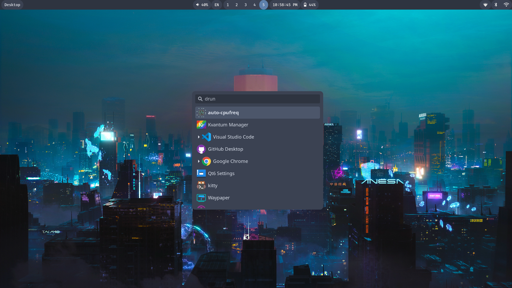

# myHyprland Dotfiles

This is my arch linux + hyprland setup + nordic

## Screenshots




## Details

- **OS**: Arch Linux
- **WM**: Hyprland
- **Terminal**: Kitty
- **System font**: Noto Sans Regular
- **Terminal Font**: FiraCode Nerd Font
- **Theme**: [Nordic darker](https://github.com/EliverLara/Nordic)
- **Icons**: [papirus-icon-theme](https://github.com/PapirusDevelopmentTeam/papirus-icon-theme)
- **Status bar**: Waybar
- **Launcher**: wofi
- **Shell**: fish
- **Prompt**: starship
- **File manager**: Thunar
- **Editor**: micro/vscode
- **Wallpaper**: swww -> waypaper
- **Color picker**: hyprpicker
- **Lock**: hyprlock
- **Clipboard**: cliphist
- **Wallpapers**: [minimalistic-wallpaper-collection](https://github.com/DenverCoder1/minimalistic-wallpaper-collection) & from wallheven
- **Bluetooth**: blueberry

## How I installed this

1. Download archlinux iso
2. Configure my hard with fdisk
3. launch archinstall script

- in profile i choose xorg and amd/ati (based on your gpu and cpu)
- in additional packages install: git networkmanager

4. after arch installed i clone this repo in my home and run install.sh

```
git clone https://github.com/mhmd1619/myHyprland.git
```

```
cd myHyprland
```

```
chmod +x install.sh
```

```
./install.sh
```

5. reboot

```
reboot
```

## Shortcuts

see hyprland.conf

## Planned

- Make mpv look better
