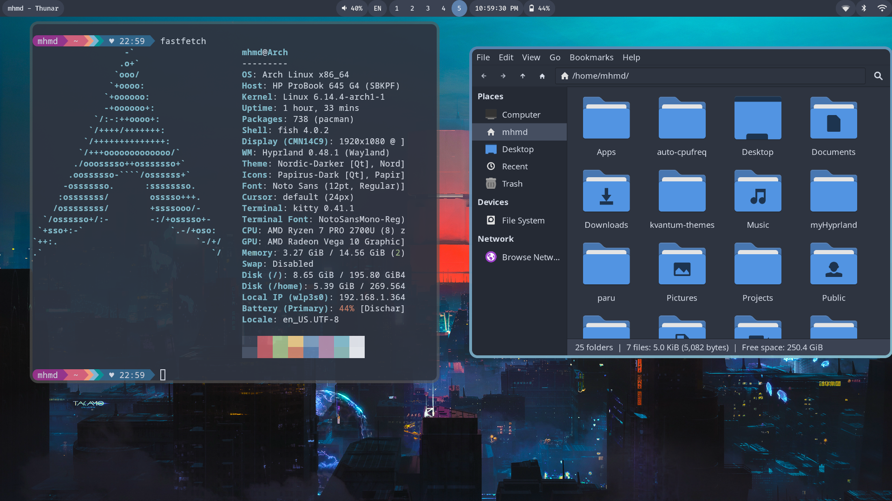

# myHyprland Dotfiles

This is my arch linux + hyprland setup

## Screenshots





## Details

- **OS**: Arch Linux
- **WM**: Hyprland
- **Terminal**: Kitty
- **System font**: Noto Sans
- **Terminal Font**: FiraCode Nerd Font
- **Theme**: [Flat remix GTK](https://drasite.com/flat-remix-gtk)
- **Icons**: [Papirus icons](https://github.com/PapirusDevelopmentTeam/papirus-icon-theme)
- **Status bar**: Waybar
- **Launcher**: [rofi-wayland](https://github.com/lbonn/rofi)
- **Rofi theme**: [rofi-theme](https://github.com/newmanls/rofi-themes-collection)
- **Shell**: zsh
- **Prompt**: oh-my-zsh
- **File manager**: Thunar
- **Editor**: leafpad/nano/vscode
- **Wallpaper**: swww
- **Color picker**: hyprpicker
- **Lock**: hyprlock
- **Clipboard**: cliphist
- **Wallpapers**: [Wallpaper-bank](https://github.com/JaKooLit/Wallpaper-Bank)
- **Logout**: wlogout
- **Bluetooth**: blueberry

## How I installed this

1. Download archlinux iso
2. Configure my hard with fdisk
3. launch archinstall script

- in profile i choose xorg and amd/ati (based on your gpu and cpu)
- in additional packages install: git networkmanager

4. after arch installed i clone this repo and run sh files to install all the packages

```
git clone https://github.com/mhmd1619/myHyprland.git
cd myHyprland
chmod +x install.sh
./install.sh
reboot
```

5. then run rofi-theme-selector
